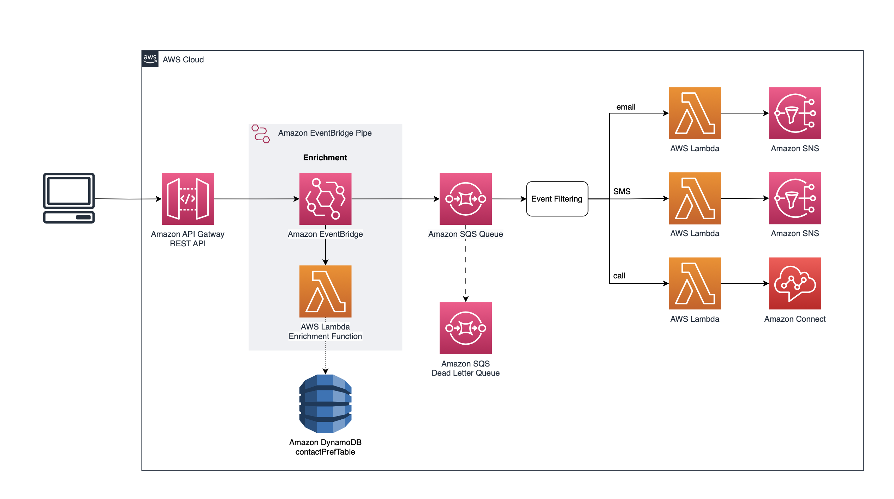

# Serverless Multi-Channel Solution for Application-to-Person Alerts
This CDK sample deploys a multi-channel Application-to-Person alerting system for hospital staff that takes a clinician's contact preferences into account based on the message's severity level. Amazon API Gateway acts as the front-door, while the processing and message publication are handled by AWS Lambda using a synchronous invocation pattern. The infrastructure is deployed using the AWS Cloud Development Kit (CDK) in TypeScript, while the Lambda functions are written in Python.

> ⚠️ Precautions ⚠️ </br>
> The code provided in this repository is a sample and should not be used for production workloads without further reviews and adaptation. 

## Table of Contents

* [Solution Overview](#solution-overview)
* [Pre-requisites](#pre-requisites)
* [Security Considerations](#security-considerations)
* [Deployment](#deployment)
* [Roadmap](#roadmap)
* [Contributing](#contributing)
* [License](#license)


## Solution Overview

### Architecture Diagram


### Components 
* [Amazon API Gateway](https://aws.amazon.com/api-gateway/) REST API - receives information about the message to be sent. An example request can be seen in the [Example](#example) section.
* [AWS Lambda](https://aws.amazon.com/lambda/):
    * Amazon API Gateway token-based Authorizer  - checks authorisation token (header) and accepts/denies access to the downstream resources, implemented as a static value that can be set in the variables when deploying. More secure options can be found under [Security Considerations](#security-considerations).
    * Processing function - processes the message received from API Gateway and publishes messages via their respective channels.
* [Amazon DynamoDB](https://aws.amazon.com/dynamodb/):
    * Contact preference table - automatically populated with the values provided as variables in /bin/serverless-multi-channel-a2p-alerts.ts; the processing Lambda function retrieves values from this table and routes the message based on the preference. 
    * Idempotency store - the storage layer for [Idempotency](https://docs.powertools.aws.dev/lambda/python/latest/utilities/idempotency/) which is implemented via AWS Lambda Powertools in the processing Lambda function. The idempotency key configured is the message_id received via the API.   
* [Amazon SNS](https://aws.amazon.com/sns/) - SMS and email messages are sent via Amazon SNS.
* [Amazon Connect](https://aws.amazon.com/connect/) - Automated phone calls using text-to-speech are delivered via a [contact flow](https://docs.aws.amazon.com/connect/latest/adminguide/concepts-contact-flows.html) for outbound calling. For more information on how the outbound calling is initiated in the processing AWS Lambda function, please check the API reference for [StartOutboundVoiceContact](https://docs.aws.amazon.com/connect/latest/APIReference/API_StartOutboundVoiceContact.html).
* [Amazon X-Ray](https://aws.amazon.com/xray/) - provides an end-to-end view of your requests as they travel through the application, making it easier to monitor, identify and troubleshoot issues and errors.

## Pre-requisites
1. Please check Amazon Connect [Countries you can call by default](https://docs.aws.amazon.com/connect/latest/adminguide/country-code-allow-list.html), as well as the prefixes not allowed by default. 
2. Create an [Amazon Connect instance](https://docs.aws.amazon.com/connect/latest/adminguide/amazon-connect-instances.html) and note down the [instance ID](https://docs.aws.amazon.com/connect/latest/adminguide/find-instance-arn.html). 
3. If one of the destination phone numbers chosen to test this demo with is a UK mobile number (has a +447 prefix), please raise an AWS Support case by navigating to [Support Cente](https://support.console.aws.amazon.com/) &#8594; Create case &#8594; Select the fields from the drop-down lists:


On the next page, summarise the request and include the Amazon Connect Instance ARN, Country and Prefix in the form below the "Description" box. 

Testing the call functionality to a UK mobile number will not work until the support ticket is resolved.

4. Set the variable values in the /bin/serverless-multi-channel-a2p-alerts.ts file.

## Security Considerations 
This demo code omits certain security features in order to save costs involved with initial testing deployments. The following list includes security recommendations if you would like to deploy this beyond a sample/PoC use case:

1. The Amazon API Gateway authorizer uses a static token value across the stack. For production deployments, use more robust [API Gateway authentication and authorization methods](https://docs.aws.amazon.com/apigateway/latest/developerguide/apigateway-control-access-to-api.html) instead. Additional information can be accessed on the [Security Best Practices in Amazon API Gateway](https://docs.aws.amazon.com/apigateway/latest/developerguide/security-best-practices.html) page.
2. The Amazon DynamoDB tables lack Point-in-Time Recovery settings and deletion protection, enable these for enhanced data security by navigating to /lib/serverless-multi-channel-a2p-alerts-stack.ts and changing the values for removalPolicy (line 49) to RemovalPolicy.RETAIN & pointInTimeRecovery (line 50) to true.
3. Amazon API Gateway access logs enabled by creating either a Amazon CloudWatch Log Group or a Amazon Kinesis Firehose delivery stream (More information can be found in the [Amazon API Gateway StageOptions](https://docs.aws.amazon.com/cdk/api/v2/docs/aws-cdk-lib.aws_apigateway.StageOptions.html) CDK documentation).  
4. Enable [AWS Web Application Firewall (WAF)](https://docs.aws.amazon.com/apigateway/latest/developerguide/apigateway-control-access-aws-waf.html) protect your API from common web exploits. 
5. Review the CDK constructs in this repo for alignment with your security requirements and consider building costum constructs if the defaults don't meet your needs.

## Deployment 

### How to 

Install the packages: 

```bash
    npm install 
```

Bootstrap your AWS account as it's required for the automated Docker image build and deployment

```bash
    cdk bootstrap aws://{ACCOUNT_ID}/{REGION}
```

Synthesize the cdk stack to emits the synthesized CloudFormation template. Set up will make sure to build and package the lambda functions residing in the /src directory: 
```bash
    cdk synth
```

Deploy the CDK application
```bash
    cdk deploy --all
```

### Confirming subscriptions
Before testing the alerting system, the subscriptions created need to be confirmed to ensure delivery of the messages. 
- Email topic subscription: you should have received an automated email from AWS asking to confirm subscription via link during the deployment, please follow the instructions in the email.
- SMS topic subscription: If the AWS account you are using for deployment is in [Sandbox](https://docs.aws.amazon.com/sns/latest/dg/sns-sms-sandbox.html), subscriptions need to be verified manually. To do this, please follow the steps detailed [here](https://docs.aws.amazon.com/sns/latest/dg/sns-sms-sandbox-verifying-phone-numbers.html). 

### Example
Example scenario for this demo: 
* DEV is deploying the stack in eu-west-2
* The destination phone number for SMS and Call is DEV's UK mobile number (+447000000000)
* The destination email address is DEV's email address (dev@dev.co.uk)
* For high priority messages, DEV wants to receive an automated phone call at the number defined for _phoneNumberCall_ (E164 format required: [+][country code][subscriber number including area code], can have a maximum of fifteen digits)
* For medium priority messages, DEV wants to receive an SMS message at the number defined for _phoneNumberSms_ (E164 format)
* For low priority messages, DEV wants to receive an email at the address defined for _email_
* DEV has opted for a random value of 384324732 for the API token


#### Variables
Set in [/bin/serverless-multi-channel-a2p-alerts.ts](bin/serverless-multi-channel-a2p-alerts.ts)

```ts
const stack = new ServerlessMultiChannelA2PAlertsStack(app, 'ServerlessMultiChannelA2PAlertsStack', {
  env: {
    region: 'eu-west-2'
  },
  phoneNumberCall: '+447000000000',
  phoneNumberSms: '447000000000', 
  email: 'dev@dev.co.uk', 
  highPriority: 'call',
  mediumPriority: 'sms',
  lowPriority: 'email',
  connectInstanceId: '<instance ID of the Amazon Connect instance>', 
  countryCode: 'GB', 
  apiToken: '384324732'
});
```

#### API Call
DEV uses Postman to invoke the API from their local machine. 
The API endpoint URL can be retrieved from the output of the 'cdk deploy' command, or by navigating to the AWS console and checking either AWS CloudFormation Outputs or the Amazon API Gateway REST API Stages tab. 
Its format is:
```
https://{restapi_id}.execute-api.{region}.amazonaws.com/{stage_name}/notification
```

**Header values:**
The value for Authorization is the API token value set above.

```json
{
    "Content-Type": "application/json",
    "Authorization": "384324732"
}
```

**Body:**
The values in the request body will be used by the processing Lambda function to route, construct and publish the message.

* Message ID: ID for each call, set by the client/DEV. Used as idempotency key and should be unique for each call made, otherwise no processing will be done by the Lambda function after the first call (even if the other values changed). More information about Idempotency can be found [here](https://docs.aws.amazon.com/lambda/latest/operatorguide/retries-failures.html) and [here](https://docs.powertools.aws.dev/lambda/python/latest/utilities/idempotency/).
* Type: the message/alert type. In this example, the type is "blood test alert", ie notification of blood test results being ready for a patient.
* Patient ID: **anonymised**/random string to denote a patient whom the test results concern, set by the client. Please do not expose PII (Personally Identifiable Information) or PHI (Protected Health Information) in the request body (eg NHS number). 
* Contact ID: string to denote the clinician ID, set by the client. The contact preference table is automatically populated with "C-1" as the contact ID for the demo, changing this value will require additional changes to the stack. 
* Description: text which will be used to construct the message delivered to the recipient. 
* Priority: can be L (low), M (medium) or H (high). This maps to the channel preference in the contact preference Amazon DynamoDB table. In the example below, based on the preferences set above, an email will be sent to C-1's email address. 

Example body for a low priority message:

```json
{
    "message_id": "123",
    "type": "blood_test_alert",
    "patient_id": "123456789",
    "contact_id": "C-1",
    "description": "Blood test results ready for patient",
    "priority": "L"
}
```

### Cleanup
Run the following command in the relevant infrastructure directory to delete the cloudformation stacks:
```bash
    cdk destroy --all
```

## Roadmap
1. Adding Amazon Connect instance creation into the stack and a boolean flag to indicate whether this should be created or not, enabling automatic deployment if there are no restrictions in your region/location that require manual steps to be followed ([Pre-requisites](#pre-requisites)) + Adding a Set Voice block in the contact flow to customise text-to-speech. 
2. Asynchronous version of this code (introducing Amazon EventBridge and Amazon SQS into architecture) + side-by-side comparison of sync vs async (latency, processing time, pros and cons). Architecture diagram for asynchronous architecture: 



## Contribution
See [CONTRIBUTING](CONTRIBUTING.md) for more information.

## Security
See [CONTRIBUTING](CONTRIBUTING.md#security-issue-notifications) for more information.

## License
This library is licensed under the MIT-0 License. See the LICENSE file.
